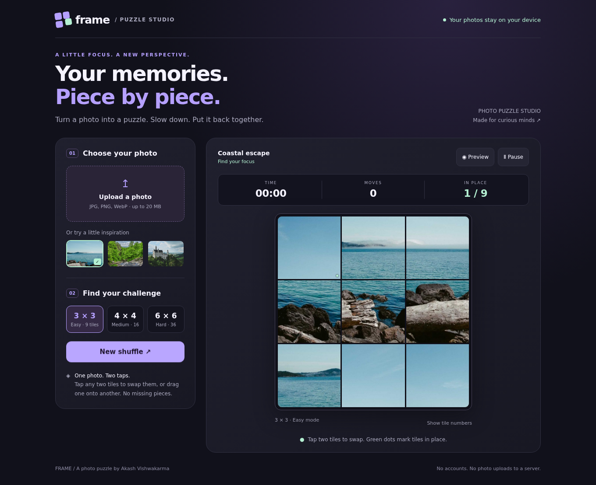
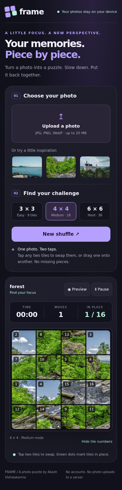
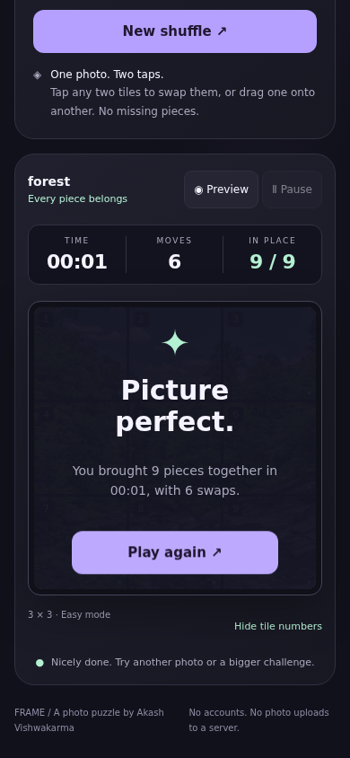

# Frame / Photo puzzle studio

A photo puzzle game by Akash Vishwakarma. Pick a photo, shuffle the tiles and bring the picture back together. A dark lavender and mint interface, built for phones and desktops.

## Play

[Open the live game](https://akash991833.github.io/photo-puzzle-studio/)


Choose a built-in photo or upload your own image, select 3 × 3, 4 × 4 or 6 × 6, then press **Shuffle & play**. Tap two tiles to swap them. On a desktop, you can also drag one tile onto another. Every puzzle is solvable because any two tiles can be swapped.

- Timer, move counter and live count of tiles in the right place
- Original-image preview; the timer keeps running while previewing
- Optional tile numbers and green indicators for correctly placed tiles
- Pause/resume, with automatic pause when you leave the tab
- Completion screen with your time and moves
- Keyboard-friendly buttons, visible focus and reduced-motion support

## Photo privacy

The repository and website are public, but your selected photos are not uploaded. Images are decoded, center-cropped to a square and resized in memory using the browser Canvas API. No backend, analytics, accounts or external runtime requests. Refreshing clears your game and photo.

JPG, PNG and WebP photos up to 20 MB are recommended. Other formats work only if your browser can decode them. HEIC support varies. Non-square photos are center-cropped, not stretched.

## Screenshots

### Desktop gameplay


### Mobile gameplay with an uploaded photo


### Finished puzzle


## Run locally

Open `index.html` in a modern browser, or serve the folder:

```sh
python3 -m http.server 8000
```

No npm install or build step is needed. HTML, CSS, JavaScript and the three sample images are bundled in a single file. GitHub Pages deploys from the root of `main`.

## Verification

Tested in Chromium at desktop and 390px mobile widths: actual file upload, sample selection, 9/16/36 tile levels, swapping, preview, pause/resume, tile numbers and solving the puzzle to completion. No horizontal overflow or JavaScript errors in those checks. Session progress is intentionally not saved.

## Sample photography

Sample photos are from [Lorem Picsum](https://picsum.photos), which provides Unsplash photos. Downloaded photo sources: https://picsum.photos/id/16/1000/1000 (coast), https://picsum.photos/id/28/1000/1000 (forest), https://picsum.photos/id/1040/1000/1000 (castle). They are bundled so gameplay has no image-service dependency.

Photography credits: [Paul Jarvis](https://unsplash.com/photos/gkT4FfgHO5o), [Jerry Adney](https://unsplash.com/photos/_WiFMBRT7Aw), and [Rachel Davis](https://unsplash.com/photos/tn2rBnvIl9I).
